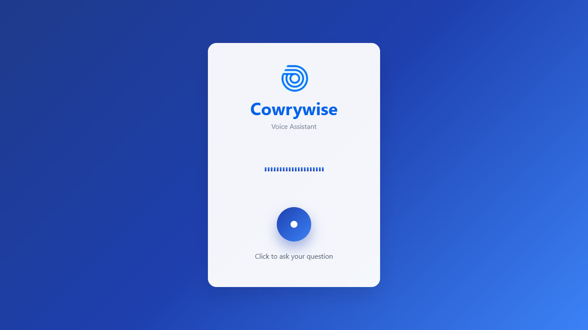

# 🎤 Voice FAQ Assistant

An AI-powered voice assistant that answers frequently asked questions using speech recognition, natural language processing, and text-to-speech.

## ✨ Key Features

* 🎙️ **Voice Recognition** with Whisper
* 🤖 **Smart FAQ Matching** using semantic similarity
* 🔊 **Text-to-Speech Responses** with gTTS
* 🌐 **Web Interface** with real-time audio visualization and silence detection
* ⚡ **Fast & Lightweight** — built with FastAPI + Vanilla JS

## 🚀 Tech Stack

* **Backend**: FastAPI (Python)
* **AI/ML**: Whisper, Sentence Transformers, spaCy
* **TTS**: gTTS
* **Frontend**: HTML + JavaScript
* **Deployment**: Railway / Render

## 📂 Project Structure

```
voice-faq-assistant/
├── main.py          # FastAPI backend
├── fva.html         # Web interface
├── 500faq.csv       # Demo FAQ dataset
├── static/          # logo
      └── cw-logo.png
├── requirements.txt # Dependencies
└── README.md
```

## ▶️ Quick Start

1. Clone the repository

   ```bash
   git clone https://github.com/yourusername/voice-faq-assistant.git
   cd voice-faq-assistant
   ```
2. Install dependencies

   ```bash
   pip install -r requirements.txt
   python -m spacy download en_core_web_sm
   ```
3. Run the app

   ```bash
   python main.py
   ```
4. Open `http://localhost:8000` in your browser

## 📊 How It Works

```
Voice Input → Whisper (STT) → Embeddings (Sentence Transformers) 
→ FAQ Match → gTTS (TTS) → Voice Output
```

## 🎯 Demo Dataset

`500faq.csv` contains a few FAQs sourced from **publicly available info** (e.g., “What is Cowrywise?”).

## 🎥 Demo Video
[](https://youtu.be/z0AT1Pk5gw0)
*( May take a few seconds to respond on free hosting.)*

## 📝 Roadmap

* [ ] Integrate with LLM


## 👨‍💻 Author

**Gift Kalu** – [LinkedIn](https://www.linkedin.com/in/gift-kalu) | [GitHub](https://github.com/giftkalu)

---

⭐ Star this repo if you find it useful!
